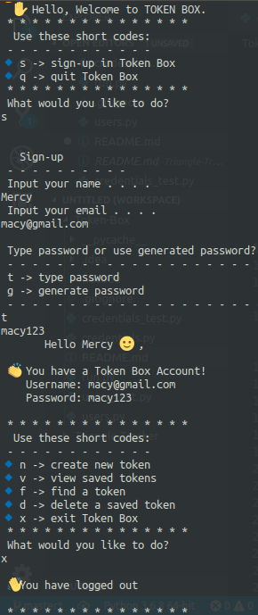

# TOKEN BOX
## Description
Token Box is an application that enables a user to store their tokens (name, email and password) in the application. As it has no user interface, interaction with the application is through the terminal.
## Token Box Screenshot


Last modified 23rd July 2019.
#### By **Mercy Muhia**

## Project behaviour

  Behaviour | Input example | Expected Output
--- | --- | ---
Sign-up | s | input name and email
Type password | t | input field
Generate password | g | password length input prompt
Add New token | n | input website, email and password
View saved tokens | v | List with saved tokens
Find saved tokens | f | token details found
Delete saved tokens | d | specified token deleted
Exit Token Box account | x | Logs user out
Quit Token Box | q | Quits the application

 
## Setup/Installation Requirements
```Git clone https://github.com/macymuhia/Token-Box.git```

```cd Token-Box```

```python3.6 run.py```
## Technologies Used
Python3.6
## Support and contact details
To contribute, submit a pull request. 
For questions or concerns, reach out on mercy8muhia@gmail.com
### License
*MIT*

### &copy; 2019 Mercy Muhia